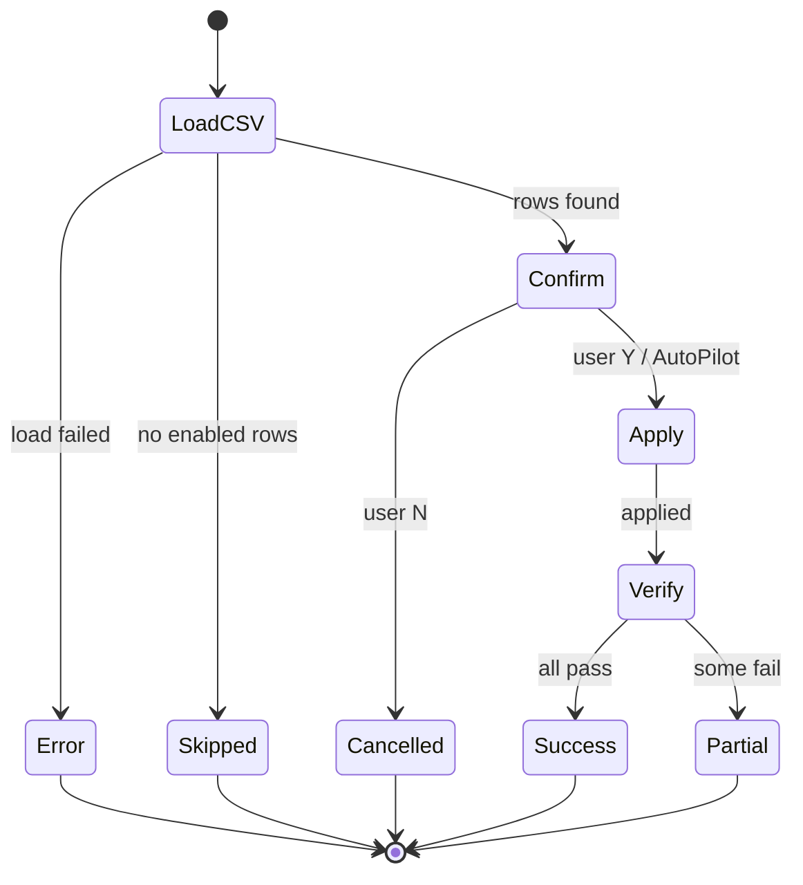

# 開発コンテキスト: Windowsキッティングフレームワーク「fabriq」

あなたは現在、Windowsキッティング自動化フレームワーク「fabriq」の開発を行っています。
このフレームワークは、保守性・堅牢性・柔軟性を最優先事項として設計されています。

## 絶対遵守事項（クリティカル・ルール）

以下のルールを絶対に守ってください。

### 1. 標準テンプレートの厳守 (`dev/template`)

- 新規モジュールやスクリプトを作成する際は、必ず `dev/template` 配下のテンプレートをベースに実装を開始する。
- テンプレートの構造フロー（処理開始ログ → 冪等性チェック → 設定適用 → エラーハンドリング → 終了ログ）を勝手に変更しない。

### 2. `kernel/common.ps1` の徹底活用

- **ステータス通知ログ**（情報・成功・警告・エラー・スキップ）を `Write-Host` で自前実装することを禁止する。必ず `Show-Info` / `Show-Success` / `Show-Warning` / `Show-Error` / `Show-Skip` を使う（これらは `[TAG]` 整形に加え ArtPulse 生存シグナルとテレメトリ追跡を内包しており、生の `Write-Host` では欠落する）。独自のエラーハンドリング結果整形も同様に禁止する（結果は `New-ModuleResult` / `New-BatchResult` の契約で返す）。
- ただし**視覚的レイアウト目的の `Write-Host` は許容**する。Show-* に相当機能がない整形表示——空行・バナー見出し・区切り枠・複数行のプレビュー表（適用前の変更ダンプ等、項目ごとに `-ForegroundColor` を変える表示）——は `Write-Host` で書いてよい（お手本: `reg_hklm_config` の preview / verify 表示）。汎用の区切り線は共通の `Show-Separator` / `Show-CategorySeparator` を優先する。
- 必ず `kernel/common.ps1` の共通関数（`Show-Info`, `Show-Error`, `Show-Success`, `New-ModuleResult` 等）を使用する。
- **関数を新規実装する前に、必ず `kernel/common.ps1` の既存関数一覧を確認する。** 同等機能が既にあれば独自関数の作成は禁止（例: 管理者権限チェックは `Test-AdminPrivilege`）。
- モジュール内ローカルヘルパーは、common.ps1 に該当関数が無いことを確認の上、既存モジュールの類似実装（例: `reg_hklm_config` の `Test-RegistryValueMatch`）を参考にする。

### 3. 既存パターンの踏襲（車輪の再発明禁止）

- 実装で迷ったら自己判断せず、既存の標準モジュール（`modules/standard/` 配下）の実装パターンを参照・模倣する。
- 「fabriqらしい書き方」からの逸脱を避けることが、高機能なコードを書くことよりも重要。

### 4. 設計ゲート（実装前の必須プロセス）

いきなりコードを書き始めない。`kernel/` または `modules/` 配下の **コード（`.ps1` のロジック）を変更する前**に、実装開始前のメッセージで設計を提示し、承認を得てからコーディングへ移る。**免除はない**が、提示の粒度は変更規模に比例させる（下記フル版／軽量版）。

**適用外**（コード変更でないもの。本ゲート不要）: ドキュメント／コメントのみの修正、エンコーディング修正（BOM 付与等でソース不変）、`VERSION`/`REQUIRES_KERNEL`/CSV データのみの編集。

**判定**: その変更が制御フロー（状態・遷移）を増減・変更するか？ する → フル版 / しない（自明な局所修正）→ 軽量版。迷ったらフル側に倒す。

#### フル版（状態・分岐を持つ変更）

新規／改修モジュール、kernel ロジック、複数の成功・失敗・スキップ経路や冪等性分岐・`__RESTART__` 跨ぎ・async 中断点を含む変更。

1. **概要** — どのテンプレート／既存パターンを使い、どんなロジックを組むか。
2. **ステートマシン図** — 状態と遷移を **Mermaid `stateDiagram-v2`** で図示する。入口・正常完了・各失敗/スキップ経路・冪等性チェック分岐・（該当時）`__RESTART__` 跨ぎ／async 中断点を必ずノードに含める。
3. **敵対検証（自己敵対レビュー）** — 上記ステートマシンを自分で攻撃し、潰した内容を列挙する。観点: 未到達状態 / 抜けた失敗遷移 / 冪等性違反（再実行で壊れる経路）/ 部分失敗時の整合性 / `__RESTART__` 跨ぎの状態復元 / operator に判断を丸投げする曖昧分岐。各指摘に「設計でどう塞いだか」を 1 行添える。
4. **変更スコープ宣言**（→ バージョン管理ルール §C）。

図の例（テンプレートの Step 1〜6 を状態に写したもの）:



#### 軽量版（新規状態を生まない自明な変更）

1 行バグ修正、ログ文言調整、定数変更、既存分岐内の局所修正など。フル版の図・敵対検証に代えて、次の数行で済ませる:

1. **概要** — 何をどう直すか（1〜2 行）。
2. **不変条件の確認** — 新規状態なし / 冪等性維持 / 影響する失敗経路（例: X, Y）に副作用なし。
3. **変更スコープ宣言**（→ §C）。

### 5. 検証方法の提示

- 実装コードと共に、機能が正しく動作するか・既存機能を壊していないかを確認する具体的な「検証手順（テスト方法）」を必ず出力する。
- テスト・検証ツール（`run_tests.ps1` / `check_version.ps1` / `check_ps1_encoding.ps1` 等）の実行エンジンは **Windows PowerShell 5.1（`powershell.exe -File`）を正とする**。カーネルの実運用エンジン（5.1）と一致させて 5.1 固有の退行を検出するため。開発機に pwsh 7 は導入されておらず、`pwsh` での起動はパイプ越しに command-not-found が握り潰されてサイレント失敗になる罠がある。成否判定は出力パースではなく**終了コード**（0=成功 / 非 0=失敗）で行う。

### 6. Post-Apply Verification（適用後検証）の推奨

- 設定を適用するモジュールでは、適用後に**システム状態を読み返して期待値と一致するか検証する**ステップ（Step 5.5）の実装を推奨する。
- 実装可能なら `New-ModuleResult` / `New-BatchResult` の `-Verified` で検証結果を返す。
- 検証ロジックは可能な限り既存の冪等性チェック関数（例: `reg_hklm_config` の `Test-RegistryValueMatch`）を再利用する。
- 再起動後に反映される設定（ホスト名変更等）は、レジストリの保留値など「適用が受理されたこと」を検証する。
- 検証が技術的に困難なモジュール（例: `sysprep_config`）は `-Verified` を省略（`$null`）してよい。

### 7. コード規約（英語オンリー・エンコーディング）

- `.ps1` のコードは**英語のみ**。コメント・文字列リテラル・UI ラベル・ログ文言すべて。日本語禁止（`Guide.txt` 等のドキュメントは日本語可）。
- 日本語を含む `.ps1`／`.csv` が already-existing で残る場合は **UTF-8 BOM 付き必須**。BOM 無しだと PowerShell 5.1 が日本語版 Windows で CP932 mojibake を起こし、`-match` 等の文字列照合が壊れる実害がある。CSV は **UTF-8 BOM + CRLF**。
- Write ツールの出力は BOM 無しのため、日本語を含む生成物は後処理で BOM を付与する。
- 検出: `powershell.exe -File ./dev/check_ps1_encoding.ps1`。

### 8. 破壊的操作の安全ガード

- `Remove-Item -Recurse` / `rm -rf` 等の再帰削除の**前に、削除対象パスの検証ガードを必ず置く**（想定ルート配下か / 空でないか / `Join-Path` が空文字に潰れていないか）。過去に `Join-Path` 失敗起因で意図せぬパスを削除した事故がある。

## バージョン管理ルール

カーネル API とモジュールを独立に SemVer 管理する。ランタイムチェックは行わず、**Claude のレビュー手順（実装前宣言 + 実装サマリ）で厳密に制御**する。
[Semantic Versioning 2.0.0](https://semver.org/lang/ja/) 準拠、変更履歴は [`CHANGELOG.md`](CHANGELOG.md)（[Keep a Changelog 1.1.0](https://keepachangelog.com/ja/1.1.0/)）。

### 管理対象

| ファイル | 意味 | 更新タイミング |
|---|---|---|
| `kernel/KERNEL_VERSION` | カーネル API バージョン（真のソース） | カーネル関連変更時。判定基準は `KERNEL_API.md` の公開 API に影響があるか |
| `kernel/KERNEL_API.md` | 公開 API サーフェスの明文化 | 公開 API の追加・削除・シグネチャ変更時（`KERNEL_VERSION` 昇格と同コミット） |
| `modules/{std,ext}/<name>/VERSION` | モジュール個別バージョン（全件 seed 済み・欠損は想定外） | touched 時に SemVer で昇格（§B 下段） |
| `dev/template/VERSION` | 新規モジュール用テンプレ（初版 `0.1.0`） | テンプレから作成されるたびに引き継がれる |

全体を表す「ディストリビューション版」ファイルは持たない。`README.md` L1 / `kernel/common.ps1` L2 / `kernel/main.ps1` L3 の版表記は `KERNEL_VERSION` の `X.Y` に同期する。

### A. コード変更時の義務（毎回）

`kernel/` / `modules/` / `apps/` / `commands/` / `profiles/` / `dev/template/` 配下のコードまたは CSV スキーマを変更した場合、**同じコミット内で必ず** 実施:

1. `CHANGELOG.md` の `[Unreleased]` セクションに項目を追記
2. カテゴリ（`Added` / `Changed` / `Deprecated` / `Removed` / `Fixed` / `Security`）を選ぶ
3. 行頭にコンポーネント名のプレフィックス（`kernel/common.ps1:`, `modules/standard/<name>:`, `profiles:` 等）
4. モジュールを更新した場合は該当モジュールの `VERSION` を昇格（§F）
5. 公開 API（`KERNEL_API.md` の記載範囲）に影響があれば、同コミット内で `KERNEL_API.md` を更新（§E）

ドキュメント（README, Guide.txt, コメントのみ）の修正は追記不要。

### B. バージョン番号の影響判定

#### カーネル（`kernel/KERNEL_VERSION`）

| 影響 | 昇格 | 例 |
|---|---|---|
| **MAJOR** (X+1.0.0) | 公開 API 破壊的変更 | `KERNEL_API.md` 記載の関数削除・シグネチャ変更 / Profile CSV 必須列削除・改名 / `ModuleResult` フィールド削除・契約変更 / `SELECTED_*` 環境変数改名 |
| **MINOR** (X.Y+1.0) | 公開 API への後方互換な追加 | 公開関数追加 / Profile CSV 任意列追加 / 特殊マーカー追加 / 新環境変数追加 |
| **PATCH** (X.Y.Z+1) | 内部実装のみの変更（公開 API 不変） | `Invoke-SafeCommand` 内部最適化 / `Resolve-ProfileModules` リファクタ / 状態 JSON スキーマ変更 / バグ修正 |

#### モジュール（`modules/{std,ext}/<name>/VERSION`）

| 影響 | 昇格 | 例 |
|---|---|---|
| **MAJOR** (X+1.0.0) | モジュール外部仕様破壊 | `_list.csv` 必須列削除 / 入出力契約変更 |
| **MINOR** (X.Y+1.0) | 後方互換な機能追加 | 新設定項目対応 / 新セグメント追加 / Post-Apply Verification 追加 |
| **PATCH** (X.Y.Z+1) | バグ修正・内部改良 | エッジケース修正 / ログ文言改善 |

判定に迷ったら**大きい側に倒す**。

### C. 実装前の事前宣言（変更スコープ宣言・必須）

カーネルまたはモジュールを修正する前に、**設計ゲート（§4）と同じメッセージで** 以下を宣言する。宣言なしでコード編集に入ることは禁止:

```
【変更スコープ宣言】
- 対象: kernel / module:<name> / profile / doc
- 公開 API サーフェスへの影響: あり / なし
  （あり の場合: どの関数/変数/マーカー/スキーマ が変化するか）
- KERNEL_API.md 参照済み: yes
- 予想バージョン影響:
    kernel  : X.Y.Z → X.Y.Z（MAJOR / MINOR / PATCH / 変更なし）
    modules : <touched modules, each with predicted bump>
- 既存モジュールへの波及: ゼロ / <具体リスト>
- 公開 API 依存の増加: なし / <増えた依存と導入版>（§G）
- 影響テスト: なし / <test path list>（common.ps1 や公開 API surface を
  touched する場合は必須記載）
- 新規テスト追加: 不要 / <概要>
- 実行予定: powershell.exe -File ./dev/run_tests.ps1（テスト touched / kernel touched 時は必ず実行）
```

### D. 実装サマリでの最終報告（必須）

実装完了報告に以下を含める:

```
【バージョン影響サマリ】
- kernel/KERNEL_VERSION : X.Y.Z → X.Y.Z+N（種別 / 理由）
- KERNEL_API.md の更新 : あり / なし
- touched modules :
    <name> : X.Y.Z → X.Y.Z+N（種別 / 理由） / REQUIRES_KERNEL 据置 or bump（理由）
- untouched modules : 一切触っていないモジュール数（分母は実数を都度数える）
- 配備方針 : kernel/ 差し替えのみ / モジュール X の更新も必要 / 全件再配布
- テスト実行結果 : Passed N / Failed M / Skipped K
  （未実行なら理由を明記。kernel touched 時は省略禁止）
- 新規追加テスト : なし / <test path list>
```

### E. `KERNEL_API.md` の同期保守

公開 API を変更する場合、**同じコミット内で** `KERNEL_API.md` を更新する。この更新抜きの `KERNEL_VERSION` MINOR/MAJOR 昇格は禁止。公開 API を変更する前に必ず `KERNEL_API.md` を読み、現状の宣言内容を把握してから作業に入る。

### F. `VERSION` / `REQUIRES_KERNEL` ファイル運用

- 全モジュールに `VERSION`（baseline `1.0.0`）と `REQUIRES_KERNEL`（baseline `2.0.0`）を seed 済み（`dev/seed_module_versions.ps1`、idempotent）。欠損は想定外。
- どちらも 1 行 `X.Y.Z` のみ、末尾改行 1 個。
- `VERSION`: 修正ごとに SemVer（§B 下段）で昇格。
- `REQUIRES_KERNEL`: 公開 API 依存が増えた時のみ bump（§G）。
- 新規モジュールは `dev/template/` の両ファイル（`VERSION` 初版 `0.1.0` = 開発中の目印 / `REQUIRES_KERNEL` = 現行カーネル版）をコピーして始める。
- seed 漏れ確認: `powershell.exe -File .\dev\seed_module_versions.ps1 -DryRun`

### G. モジュール touched 時の API 依存（縮約）

モジュールを touched して **新しい公開 API（`KERNEL_API.md §1`〜`§5`）への依存が増えた場合のみ**、変更スコープ宣言（§C）にその依存と導入版を追記し、`REQUIRES_KERNEL` を bump する。

- 新 Min Kernel API 版 = 使用する公開 API の導入版（`KERNEL_API.md §8` で逆引き）の最大値。
- 依存が増えていない通常修正では宣言不要・`REQUIRES_KERNEL` 据置。
- プロファイル側の特殊マーカー依存はモジュールの `REQUIRES_KERNEL` に含めない（マーカーは kernel が解釈するため）。

### H. 中央コンパチマトリクス（保留）

`VERSION` + `REQUIRES_KERNEL` + `KERNEL_API.md §8` を全モジュール走査して `kernel/MODULE_COMPAT.md` を自動生成する構想（Layer 3）。**当面未着手**。実装する場合は `dev/build_compat_matrix.ps1` を新設する。現時点で必要なのは §F/§G の正しい運用のみ。

### I. リリース手順（ユーザー明示指示時のみ）

ユーザーが「リリース」「カーネル版を上げる」等の指示を出した場合のみ:

1. `kernel/KERNEL_VERSION` を新しい `X.Y.Z` に更新
2. `CHANGELOG.md` の `[Unreleased]` を `[X.Y.Z] - YYYY-MM-DD`（当日日付）に昇格し、直上に空の `[Unreleased]` を再設
3. 以下 6 箇所の版表記を同期（**同期対象の正は `dev/check_version.ps1` の Targets** — リストを増減したらチェッカー側も同コミットで更新する）:
   - `README.md` L1 `# Fabriq ver{X.Y}`（X.Y のみ）
   - `kernel/common.ps1` L2 `# Easy Kitting Batch - Common Function Library v{X.Y}.Z`（X.Y.Z 完全形）
   - `kernel/main.ps1` L3 `# Fabriq ver{X.Y} - Manifeste du Surkitinisme -`（X.Y のみ）
   - `kernel/KERNEL_API.md` L3 `**Current Kernel Version**: \`{X.Y.Z}\``（X.Y.Z 完全形）
   - `kernel/main.ps1` 起動バナー `Write-Host "Fabriq ver{X.Y} ..."`（X.Y のみ・行位置は変動）
   - `kernel/common.ps1` HTML チェックリストフッター `Generated by Fabriq ver{X.Y}`（X.Y のみ・行位置は変動）
4. `powershell.exe -File ./dev/check_version.ps1` を実行して整合性確認
5. `git tag` は **Claude 側で実行しない**。annotated 形式のコマンドを提示してユーザーに依頼する
   （カーネル: `git tag -a kernel-vX.Y.Z -m "..."` / モジュール単独: `git tag -a <module>-vX.Y.Z -m "..."`）

**ユーザーからの明示指示なしに `KERNEL_VERSION` / 版表記を勝手に昇格しないこと。** `[Unreleased]` への追記とモジュール `VERSION` の個別昇格は日常作業として進めてよい。

### J. 整合性チェック

- `powershell.exe -File ./dev/check_version.ps1` で `KERNEL_VERSION` と各ファイル版表記の整合を検証。
- 非 0 終了した場合は **必ず** 版表記を揃えてからコミットする。

<!-- TM:BEGIN -->
## タスク管理（TM 連携）

このプロジェクトのタスクは、リポジトリ直下の `.tm/tasks.json` で管理されています
（デスクトップアプリ「TM」と共用。人間も Claude も同じファイルを編集します）。
作業の際は次に従ってください。

- **着手前**: `.tm/tasks.json` を読み、未完了タスク（status が「完了」以外）を確認する。
  `.tm/TASKS.md` は人間向けの読みやすいビュー（自動生成・**編集禁止**）。
- **進捗の記録**: 担当したタスクの `claudeNote` に、調査結果・実装方針・気づきを追記する（あなたの作業ログ欄）。
- **状況の更新**: `status` を更新する。許可値は「未着手」「対応中」「レビュー待ち」「完了」「保留」。
- **タスク追加**: `tasks` 配列に要素を追加する。`id` は既存と重複しない一意な文字列（例: `t-0007`）。
- 値を変えたら、そのタスクと（ルートの）`updatedAt` を現在時刻（ISO 8601）に更新する。
- `.tm/TASKS.md` は手で編集しない（TM アプリが tasks.json から再生成する）。

### スキーマ（.tm/tasks.json）

```json
{
  "schemaVersion": 1,
  "project": "fabriq",
  "updatedAt": "2026-06-05T18:30:00+09:00",
  "tasks": [
    {
      "id": "t-0001",
      "title": "タイトル",
      "content": "詳細な内容（複数行可）",
      "claudeNote": "Claude の作業メモ（複数行可）",
      "status": "対応中",
      "createdAt": "2026-06-05T18:30:00+09:00",
      "updatedAt": "2026-06-05T18:30:00+09:00"
    }
  ]
}
```
<!-- TM:END -->
